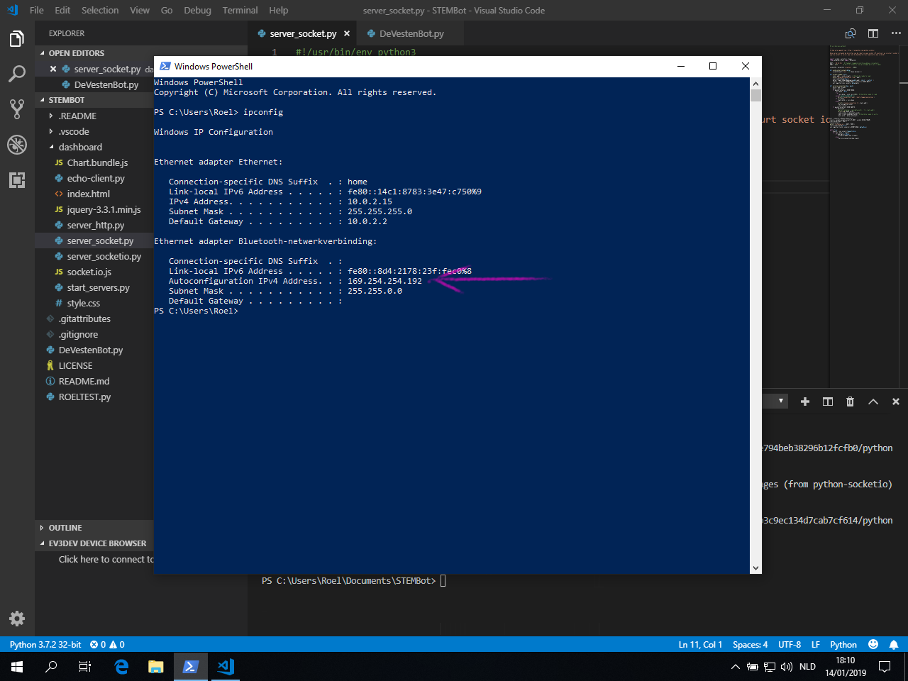

# SO De Vesten STEM Robot

Abstractie van de STEM Robot componenten zodat leerlingen snel aan de slag kunnen om hun robot te programmeren met Python.

[](http://www.youtube.com/watch?v=FU8u0rGUB5M "De Vesten STEM bot met dashboard")

## Vereisten

### STEM Robot

Dit werkt alleen met deze robots:


| Poort | Sensor
|-------|-------------|
| 1     | Touch       |
| 2     | Gyro        |
| 3     | Kleur/Licht |
| 4     | Ultrasoon   |

| Poort | Motor  |                          |
|:-----:|:-------|:-------------------------|
| A     | Medium | grijper                  |
| B     | Groot  | aandrijving linker wiel  |
| C     | Groot  | aandrijving rechter wiel |
| D     | Geen   |                          |

### EV3Dev

Ev3dev is een besturingssysteem voor de Lego EV3 brick gebaseerd op Debian Linux. Dit moet op een SD-kaartje geschreven worden dat in de Robot geplaatst wordt. Volg de instructies op de website van [ev3dev](http://www.ev3dev.org).

### Verbind je laptop met de robot

De makkelijkste manier is werken met bluetooth maar met een usb-kabel lukt het ook. Volg de instructies van [ev3dev](https://www.ev3dev.org/docs/tutorials/connecting-to-the-internet-via-bluetooth/).

### Visual Studio Code

Download [Visual Studio Code](https://code.visualstudio.com/) en configureer dit om met Python en Mindstorms te werken. Volg hiervoor de instructies op [deze pagina](https://github.com/ev3dev/vscode-hello-python) maar in plaats van het vscode-hello-python project te downloaden download je best dit STEM Robot project, dat kan je doen bovenaan deze pagina.

Een programma naar de robot sturen en uitvoeren kan je doen door op "F5" te drukken.

### Unable to import 'ev3dev2.motor'

Als je de klasse DeVestenBot.py opent of onderaan in VS Code naar "Problems" kijkt zie je dat er een aantal problemen zijn, allen "Unable to import ...". 


Dit komt omdat ev3dev2, wat nodig is om de Mindstorms onderdelen aan te sturen, niet geïnstalleerd is op je pc. Dat hoeft geen probleem te zijn aangezien het OS op het SD-kaartje in de robot deze wel heeft. Als je zelf wat wil experimenteren is het handig dat je dit wel installeert.

Klik onderaan op "Terminal" of open een command prompt of powershell en typ: `pip install python-ev3dev2`.


Hierna zijn de foutmeldingen weg en kan je ook ctrl-klikken op de klassen, de code-completion en tool tips gebruiken.

## Hoe beginnen?

1. Maak een nieuwe file met een `.py` extensie.
2. Specifieer dat je Python 3 gebruikt: `#!/usr/bin/env python3`
3. Importeer de `DeVestenBot` klasse: `from DeVestenBot import DeVestenBot`
4. Instantieer `DeVestenBot`, ik noem hem "bot" maar dat is niet verplicht: `bot = DeVestenBot()`
5. Gebruik die instantie om de robot te controleren, bv: `bot.rij_centimeters(50)`

Het begin van je script zou er zo moeten uitzien:

```python
#!/usr/bin/env python3

from DeVestenBot import DeVestenBot

bot = DeVestenBot()
```
### Voorbeeld 1: rij tot aan obstakel

Er zijn `meet_afstand_in_cm`- en `rij_centimeters`-functies voorzien. Deze kunnen we gebruiken om tot aan een obstakel te rijden.

```python
afstand = bot.meet_afstand_in_cm()

bot.rij_centimeters(afstand)
```

Als we deze code uitvoeren merken we dat de robot het obstakel ramt en dan pas stopt. Dat komt omdat de robot iets voor de afstandssensor
uitsteekt, als we een offset toevoegen om hiermee rekening te houden gaat het beter.

```python
afstand = bot.meet_afstand_in_cm()

bot.rij_centimeters(afstand - 5)
```

De code werkt maar ze is niet echt "proper", iemand die zonder voorkennis deze code leest zal zich afvragen waarom die ```- 5``` er staat. 
We zouden commentaar kunnen toevoegen maar dat zorgt er gewoon voor dat die persoon nog meer moet lezen en als we later de code veranderen
vergeten we misschien de commentaar te updaten, waardoor deze verouderd of zelfs fout kan zijn. Dit zorgt dan voor nog meer verwarring.

Beter is een variabele te introduceren met een duidelijker naam, waardoor de code klaar en duidelijk wordt:

```python
afstand = bot.meet_afstand_in_cm()

offset = 5

bot.rij_centimeters(afstand - offset)
```

Veel beter, al is het niet op het eerste zicht duidelijk dat dit stuk code zorgt dat de robot rijdt tot aan een obstakel. Om dit te weten
moeten we de code al lezen en zelf interpreteren. Als het aantal lijnen code klein is, zal dit geen grote problemen opleveren, maar met alle
functionaliteit die we toevoegen wordt dit probleem steeds groter. Daarom steken we deze code in een eigen functie en geven we die
functie een beschrijvende naam:

```python
def rij_tot_obstakel():
    offset = 5
    afstand = bot.meet_afstand_in_cm()
    bot.rij_centimeters(afstand - offset)

rij_tot_obstakel()
```

Wie nu de code induikt, ziet meteen wat dit moet doen; namelijk 'rij tot obstakel'. Als je wil weten **hoe** dit gebeurt, kan je de code bekijken in 
de aangeroepen functie. 

De uiteindelijke code ziet er zo uit:

```python
#!/usr/bin/env python3

from DeVestenBot import DeVestenBot

bot = DeVestenBot()

def rij_tot_obstakel():
    offset = 5
    afstand = bot.meet_afstand_in_cm()
    bot.rij_centimeters(afstand - offset)

rij_tot_obstakel()
```

### Voorbeeld 2: in een vierkant rijden

In een vierkant rijden is makkelijk, 4 stukken rechtdoor, met daartussen 90° draaien. In theorie is 3 keer draaien genoeg maar laten we 4 keer draaien
omdat we dan gewoon `4 * (rijden + draaien)` kunnen doen, dat is makkelijker te programmeren. 

```python
#!/usr/bin/env python3

from DeVestenBot import DeVestenBot

bot = DeVestenBot()

def rij_in_vierkant(lengte_zijde=20):
    for _ in range(4):
        bot.rij_centimeters(lengte_zijde)
        bot.draai_links()

rij_in_vierkant()
```

Aan de functie `rij_in_vierkant` geef ik geen parameter mee, de optionele parameter `lengte_zijde` is standaard gelijk aan 20. Als je een ander formaat
van vierkant wil rijden kan je deze parameter wel meegeven, ofwel op positie (nu is er maar één):

```python
rij_in_vierkant(50)
```

Ofwel met de parameternaam bij:

```python
rij_in_vierkant(lengte_zijde=50)
```

Als je twijfelt wat het beste is, denk dan even na wat het duidelijkst (meest leesbaar) is. Twijfel je dan nog dan maakt het waarschijnlijk niet uit.

## DeVestenBot.py

Deze klasse bevat een abstractie voor de robot met een aantal nuttige functies die je kan gebruiken in je eigen scripts. Zo kan je de robot laten rijden tot aan een hindernis zonder dat je de afzonderlijke motors en sensors moet bedienen en uitlezen.

Een kort overzicht van de beschikbare functies staat hieronder, voor de details kan je in de klasse kijken of gebruik maken van de tips in VSCode.

### Rijden

#### rij_centimeters

Laat de robot het gegeven aantal centimeters rijden. Gebruik negatieve getallen om achteruit te rijden.

#### rij_tot_kleur_gelijk_aan

Rijdt rechtdoor tot de gemeten kleur gelijk is aan de gegeven kleur.

```python
#!/usr/bin/env python3

from DeVestenBot import DeVestenBot

bot = DeVestenBot()

bot.rij_tot_kleur_gelijk_aan(bot.kleur.COLOR_WHITE)
```

#### rij_tot_kleur_verschillend_van

Rij rechtdoor tot de gegeven kleur niet meer gemeten wordt.

```python
#!/usr/bin/env python3

from DeVestenBot import DeVestenBot

bot = DeVestenBot()

kleur_start = bot.get_kleur()

bot.rij_tot_kleur_verschillend_van(kleur_start)
```

#### noodstop

Stopt alle huidige beweging van de wielmotors, bv als deze in een andere thread moesten runnen, en remt actief.

### Draaien

#### draai_graden

Geef het aantal graden die de robot moet draaien. Positief is naar rechts draaien, negatief naar links. Let op dat er een afwijking mogelijk is,
bij het meermaals na elkaar gebruiken van een van de draai-functies kan de cummulatieve afwijking groot worden, zeker als er vaak in dezelfde
richting gedraaid wordt.

#### draai_links

Draai de robot 90° links.

#### draai_rechts

Draai de robot 90° rechts.

#### keer_om

Wat denk je zelf dat dit doet?

### Grijper

#### grijper_open

Zet de grijper omhoog.

#### grijper_sluit

Doe de grijper omlaag.

### Sensoren

#### meet_afstand_in_cm

Geeft het aantal centimeter terug gemeten vanaf de ultrasone sensor, als je dit gebruikt om je robot tijdig te laten stoppen hou er dan rekening mee
dat de voorkant van de robot een paar centimeter dichterbij de hindernis is dan de sensor.

#### is_druksensor_ingedrukt

Geeft True of False terug afhankelijk van of de sensor ingedrukt is of niet.

#### get_kleur

Geeft de code van de gemeten kleur terug.

Gebruik bij voorkeur een van de enums zoals `bot.kleur.COLOR_YELLOW` om te testen op kleur. Dit verhoogt de leesbaarheid van je code.

Dit voorbeeld print voortdurend de gemeten kleur in de console van VS Code:

```python
#!/usr/bin/env python3

from DeVestenBot import DeVestenBot

bot = DeVestenBot()

kleur_dictionary = {
    bot.kleur.COLOR_NOCOLOR: "GEEN KLEUR",
    bot.kleur.COLOR_BLACK: "ZWART",
    bot.kleur.COLOR_BLUE: "BLAUW",
    bot.kleur.COLOR_GREEN: "GROEN",
    bot.kleur.COLOR_YELLOW: "GEEL",
    bot.kleur.COLOR_RED: "ROOD",
    bot.kleur.COLOR_WHITE: "WIT",
    bot.kleur.COLOR_BROWN: "BRUIN"
}

while(True):
    bot.log(kleur_dictionary[bot.get_kleur()])
```

### Output

#### log

Console logging (remote)

Gebruik `bot.log("tekst")` om tekst te schrijven in de VS Code outputconsole. Handig om je programma te debuggen.

#### Geluid

##### spreek

Laat de robot praten met text-to-speech, geef de zin mee in een string als parameter: `bot.spreek("I only speak english")`

De robot voert de volgende commando's al uit terwijl hij praat tenzij je de parameter "wacht" op `True` zet: `bot.spreek(zin="Hi everybody", wacht=True)`

##### speel

De robot speelt een wav-bestand af, net zoals met `spreek` kan je hem laten wachten met andere commando's uitvoeren door de parameter "wacht" op `True` te zetten.

# Het dashboard

Ik heb de mogelijkheid voorzien om de sensordata van je robot in de gaten te houden terwijl de robot zijn programma uitvoert.

## Opgepast

Tijdens het testen heb ik gemerkt dat de gyrosensor soms compleet flipt als er teglijk sensordata verstuurd wordt. Dit zorgt ervoor dat de de draai-commandos die de gyro gebruiken niet goed werken. Gebruik daarom `draai_graden_geen_gyro` in plaats van `draai_graden`. Het kan natuurlijk ook aan deze specifieke robot gelegen hebben dus test het zelf eerst uit.

## Packages installeren

De servers gebruiken nog enkele extra packages, deze installeer je door volgende commandos in een terminal of shell te typen:

```
pip install socketio-client

pip install python-socketio

pip install aiohttp
```

## IP-adres juist zetten

Als je robot correct verbinding heeft gemaakt met je laptop heeft deze een ip-adres gekregen. Dat kan je bovenaan het schermpje zien, bv `169.254.142.233`. 

Typ `ipconfig` in een shell (in Linux `ifconfig`) en zoek het ip-adres van je laptop dat in hetzelfde netwerk zit. Hier is dat `169.254.254.192`.



Pas nu in de bestanden `DeVestenBot.py` en `dashboard/server_socket.py` de variabelen aan naar de waarde van het ip-adres van je laptop.


## De servers starten

Nu kunnen we de nodige services starten. Navigeer met de bestandsbeheerder naar de dashboard folder in het project. Doe shift+rechtsklik om een menu te openen en kies `PowerShell-venster hier openen`. 


Doe dit drie maal en voer de volgende commandos uit. Eén per venster:

```
python.exe .\server_http.py

python.exe .\server_socket.py

python.exe .\server_socketio.py
```

Als je een beveiligingsmelding krijgt van de firewall met je dit natuurlijk toelaten.


## Het dashboard openen

Navigeer met je browser naar `http://localhost:8080`. Als er onder de titel `connected: true` verschijnt is het in orde.


## De correctiefactor voor draaien instellen

Ga terug naar VS Code en open `DeVestenBot.py`, zet op regel 296 de correctiefactor op 1.


Open het script `ROELTEST.py`. Dit bevat de volgende code:

```python
#!/usr/bin/env python3

from DeVestenBot import DeVestenBot

bot = DeVestenBot()

for _ in range(4):
    bot.rij_centimeters(20)
    bot.grijper_sluit()
    bot.grijper_open()
    bot.draai_graden_geen_gyro(-90)

bot.exit_program()
```

Als je al verbinding hebt met je robot (groene bol in de EV3dev Device Browser) kan je dit uitvoeren op de bot door F5 te drukken. Van zodra de robot begint te rijden zal je ook het dashboard zien opvullen.


Een paar dingen vallen op. Ten eerste zijn de kleuren fucked in de Microsoft Edge en ten tweede heeft de robot te ver gedraaid. 

Het foute draaien komt doordat de robot een afwijking heeft ahankelijk van welke robot je gebruikt, hoe vlot de mechaniek kan bewegen en zelfs hoe vol de batterij is. We zien op het dashboard dat de robot in totaal -386° gedraaid heeft in plaats van de verwachte -360. Dat wil zeggen dat we de correctiefactor op 360/386 = 0.9326 moeten zetten. Draai vervolgens het programma opnieuw en de afwijking zou veel kleiner moeten zijn.


Nu is er een afwijking van 6°, hou er rekening mee dat de gyrosensor ook een afwijking heeft van enkele graden dus dit is een goed resultaat. Spijtig genoeg is de robot niet echt consequent, de exacte hoek kan elke rit een beetje verschillen. Hou hier rekening mee en maak gebruik van de sensors om eventueel bij te sturen.